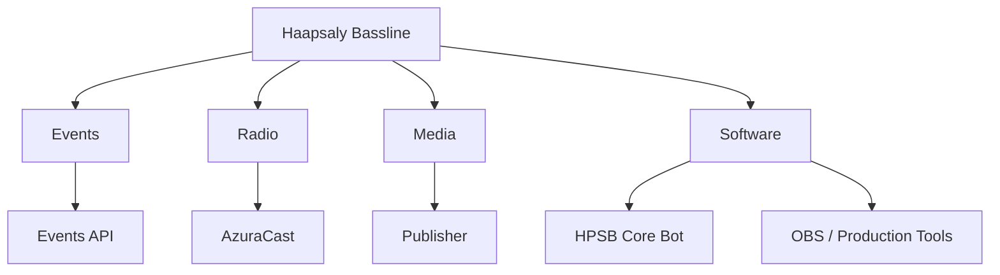

# Haapsaly Bassline

### Hardcore · Bass Music · Events · Radio · Software

**Haapsaly Bassline (HPS)** is an independent music event platform creating, running and supporting **real, virtual and hybrid events** around hardcore, bass music and other hard electronic music.

[Website](https://hpsbassline.club) • [Events](https://hpsbassline.club/events) • [Radio](https://hpsbassline.club/radio)

---

## What you'll find here

This organization contains the software and tools we build for HPS.

# Haapsaly Bassline

> Independent music event platform focused on hardcore, bass music and other hard electronic music.

Haapsaly Bassline (HPS) creates, runs and supports real, virtual and hybrid events.

This organization contains the software, services and tools built for HPS.

## Main projects

| Project | Description |
|:--|:--|
| [**hpsbassline.club**](https://github.com/Haapsaly-Bassline) | HPS website and web platform |
| [**HPSB Core Bot**](https://github.com/Haapsaly-Bassline/HPSB-Core-Bot) | Main Discord bot and automation |
| [**Discord Events API**](https://github.com/Haapsaly-Bassline/Discord-Events-API) | Discord Scheduled Events API |
| [**Festival Web Timer**](https://github.com/Haapsaly-Bassline/Festival-Web-Timer) | Synchronized event timer |
| [**HPS Bassline OBS Widget**](https://github.com/Haapsaly-Bassline/HPS_Bassline-OBS-Widget) | AzuraCast widget for OBS |
---

## HPSB Core Bot

What it does

The main Discord bot used by HPS.

It currently includes:

- Lavalink music system
- HPS events, releases and news publishing
- YouTube integrations
- Live stream notifications
- Moderation and automod
- ModCall
- Private voice rooms
- Server statistics
- Partner publishing

The bot is built around independent modules, so different parts of the system can be enabled, disabled or restarted separately.

## Music

HPS mainly works with:

`Hardcore` · `Happy Hardcore` · `UK Hardcore` · `Drum & Bass` · `Hardstyle` · `Frenchcore` · `J-Core` · `Speedcore` · `Hard Dance`

---

> [!NOTE]
> Not every repository here is an active production service. Some are experiments, prototypes, utilities or older HPS projects kept for reference.

<strong>Technology</strong>

A mix of self-hosted services, APIs and production tools.

`Node.js` · `Python` · `Java` · `Discord API` · `Lavalink` · `AzuraCast` · `Express` · `WebSocket` · `REST` · `RSS` · `OBS`

---

**Haapsaly Bassline**

[Website](https://hpsbassline.club) · [GitHub](https://github.com/Haapsaly-Bassline)

**contact@hpsbassline.club**

